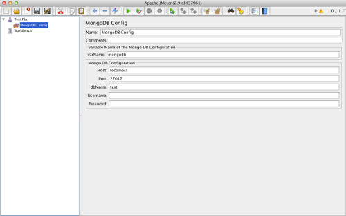
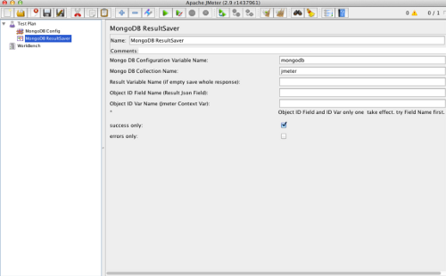

#jmeter-mongodb-plugin
=====================

a jmeter plugin support save sampler json response to mongodb,for query and search.
for extract json response,copy JsonPathExtractor from [jmeter-components](https://github.com/ATLANTBH/jmeter-components)

latest version: 0.4

## Install and Usage

1. git clone https://github.com/jolestar/jmeter-mongodb-plugin.git
2. download [jmeter-mongodb-plugin jar](https://github.com/jolestar/jmeter-mongodb-plugin/raw/mvn-repo/com/jolestar/jmeter-mongodb-plugin/0.4/jmeter-mongodb-plugin-0.4.jar) or run  
		
		mvn clean install
	
	build your self.
	
	cp jmeter-mongodb-plugin-0.4.jar to $JMETER_HOME/lib/ext directory.
	cp lib/*.jar to $JMETER_HOME/lib/

3. in a JMeter test plan ,add **Config Element** -> **MongoDB Config**
4. in a JMeter test plan ,add **Listener** -> **MongoDB ResultSaver**
	

## Screen Shots

## more info about jemeter plugin dev

[jmeter-plugin-develop](http://jolestar.com/jmeter-plugin-develop/)
